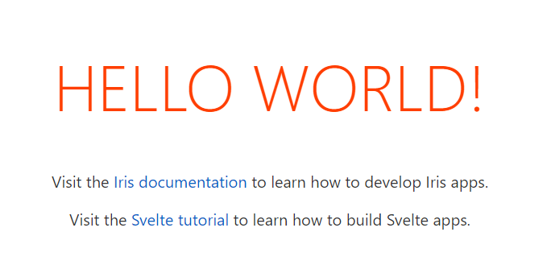

# svelte app

[](https://github.com/iris-contrib/svelte-template/actions) [](https://goreportcard.com/report/github.com/iris-contrib/svelte-template)


This is a project template for [Iris](https://iris-go.com) & [Svelte](https://svelte.dev) apps based on [sveltejs/template](https://github.com/sveltejs/template).



## Prerequisites

You will need to have:

- [Iris CLI](https://github.com/kataras/iris-cli) installed to run the `iris-cli` command.
- [Node.js](https://nodejs.org) to build the frontend application.
- [Go](https://golang.org) to run the web server.

## Get started

Install the template with [Iris CLI](https://github.com/kataras/iris-cli):

```sh
iris-cli new --module=my-app svelte
```

Install the dependencies and build the svelte app with [Rollup](https://rollupjs.org)...

```sh
cd app
npm install
npm run dev (for livereload)
```

...then **start the Iris web server**:

```sh
cd ../
go run main.go
```

Navigate to [localhost:8080](http://localhost:8080). You should see your app running.

For building the production bundle:
```sh
cd app
npm run build (for build the production bundle)
```